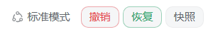
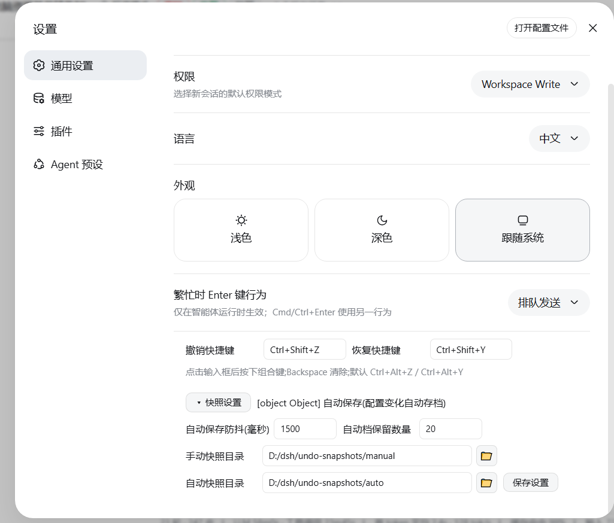
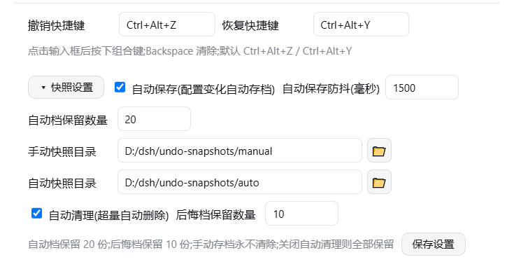
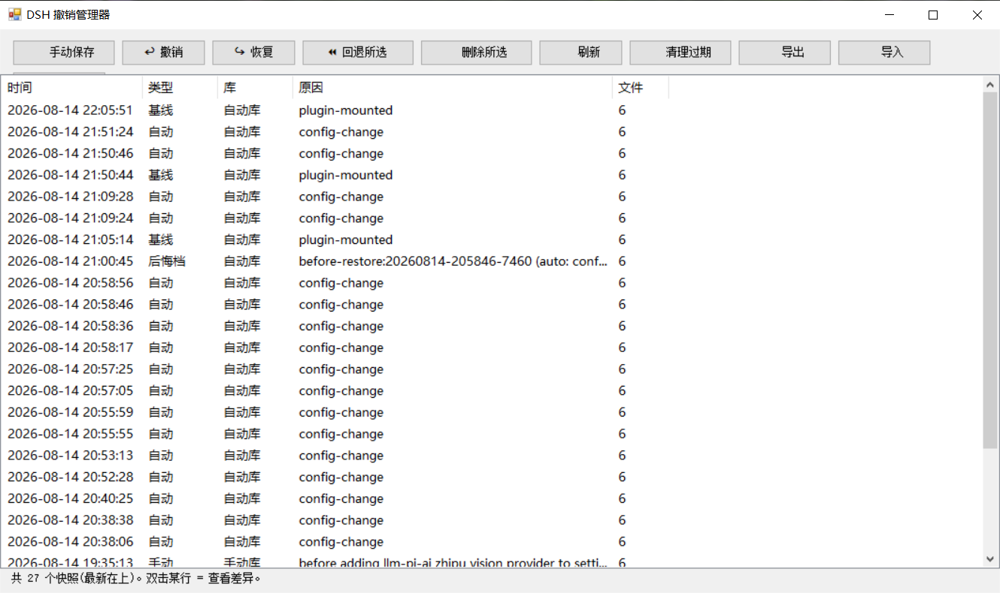

# dsh-undo — Undo/rollback system for DSH

> English | [中文](README.md)

An undo/rollback system for [DeepSeek Harness (DSH)](https://github.com/deepseek-ai/deepseek-harness): **every plugin install, skin switch or settings change is auto-snapshotted; manual saves whenever you want; one-click undo / redo / restore to any version** — plus offline CLI & GUI tools that still work even when DSH fails to boot.

## Preview

| Header buttons (Undo / Redo / Snapshots) | Settings: shortcuts & snapshot options |
|---|---|
|  |  |

| Snapshot manager panel (restore to any version) | Offline GUI (DSH Undo Manager) |
|---|---|
|  |  |

## Features

| Entry | Capability |
|---|---|
| **WebUI header buttons** | Red **Undo**, green **Redo** and **Snapshots** buttons, visible in every session |
| **Snapshot manager panel** | Visual list (time / type / reason / file count / store), **restore to any snapshot version**, **delete snapshots**, manual save, refresh |
| **Keyboard shortcuts** | Default **Ctrl+Alt+Z** (undo) / **Ctrl+Alt+Y** (redo), customizable in Settings → General |
| **Dual save modes** | **Manual saves** (never auto-pruned) + **auto saves** (debounced 1.5 s snapshot on config change, keeps latest 20); **the two modes have separate storage locations** |
| **Configurable options** | Settings → General → Snapshot Settings: auto-save toggle, debounce ms, auto snapshots kept, manual/auto snapshot directories, applied immediately |
| **Chat commands** | Just tell the AI "undo the last step / roll back / redo / save a snapshot / list snapshots" — tools are called automatically |
| **Undo/redo stack** | Multiple consecutive undos; redo re-applies the pre-undo state (blocked when newer changes exist); every restore first preserves the current state as a "pre-restore" snapshot |
| **Offline tools** | CLI (`snapshot/undo/redo/restore/remove/list/diff/prune/status`) + **GUI window** (desktop shortcut) + safe plugin-install wrapper |

## What is snapshotted & where

The snapshot captures DSH's 6 config files: `cordis.patch.yml`, `package.json`, `cordis.yml`, `pnpm-workspace.yaml` (under the profile) + `settings.yaml`, `.env` (under `~/.dsh`).

| Store | Default path (configurable in settings) | Contents |
|---|---|---|
| Manual store | `<snapshot root>\manual\` | Manual snapshots (never auto-pruned) |
| Auto store | `<snapshot root>\auto\` | Auto snapshots, boot baselines, undo pre-restore snapshots (auto keeps latest 20) |
| Legacy store | `<snapshot root>\` root | Old flat layout — still read, auto-migrated on startup |

> ⚠️ Snapshots contain copies of `.env` etc. which may include secrets — do not share or push them.

## Installation

Prerequisites: DSH (`@deepseek-ai/dsh`) and Node.js (≥20).

1. **Clone the repository** into a local plugins directory (an ASCII path is safer), e.g. `D:\dsh\plugins\dsh-undo`:

```bat
git clone https://github.com/lire1131/dsh-undo-plugin.git D:\dsh\plugins\dsh-undo
```

2. **Create a junction** so DSH's module resolver can find the local package by name `dsh-undo` (used by both the host plugin and the WebUI client plugin):

```bat
mklink /J "<your-dsh-install>\node_modules\dsh-undo" "D:\dsh\plugins\dsh-undo"
```

> DSH resolves package names by walking up from its own `node_modules`. The default location is `C:\Users\<username>\node_modules` when npm installed into the user directory; if you run DSH from an npx cache, junction into that cache's `node_modules` instead. Check the path in DSH's startup error output or run `npm root -g`.

3. **Mount it in the profile patch layer**: edit `<DSH_HOME>\profiles\web\cordis.patch.yml` and append:

```yaml
- insert:
    - id: dsh-undo
      name: dsh-undo
```

4. **Activate**: saving hot-reloads the host part; refresh the page to see the header buttons and settings rows; restart DSH for full steady state (legacy flat snapshots migrate automatically).

> Dependency note: the host plugin loads `@deepseek-ai/dsh-tools` via `createRequire('<dsh-install-root>/package.json')`. If DSH lives elsewhere, set the environment variable `DSH_ROOT=<dsh-install-root>` — no extra package installation needed.

## Usage

- **Undo**: header **Undo** button / `Ctrl+Alt+Z` / tell the AI "undo the last step".
- **Redo**: **Redo** button / `Ctrl+Alt+Y` (only when nothing changed since the undo).
- **Manual save**: "Save" in the panel / tell the AI "save a snapshot" / CLI `snapshot`.
- **Restore to a fixed version**: click "Restore to this" on a row in the panel; or tell the AI "restore to <id>"; or CLI `restore -Id <id>`.
- **Delete a snapshot**: "Delete" in the panel; or CLI `remove -Id <id>`.
- **Custom shortcuts**: Settings → General → Undo/Redo shortcut (click the box then press a combo; Backspace clears).
- **Save options**: Settings → General → Snapshot Settings (auto-save toggle, debounce, keep count, two directories; the 📁 button opens the native folder picker).

### Offline tools (works even when DSH won't boot)

From the repository directory:

```powershell
# GUI window (recommended): double-click tools\dsh-undo-gui.bat, or:
powershell -NoProfile -ExecutionPolicy Bypass -File "tools\dsh-undo-gui.ps1"

# CLI
powershell -NoProfile -ExecutionPolicy Bypass -File "tools\dsh-undo.ps1" list
powershell -NoProfile -ExecutionPolicy Bypass -File "tools\dsh-undo.ps1" snapshot -Label "reason"
powershell -NoProfile -ExecutionPolicy Bypass -File "tools\dsh-undo.ps1" undo
powershell -NoProfile -ExecutionPolicy Bypass -File "tools\dsh-undo.ps1" redo
powershell -NoProfile -ExecutionPolicy Bypass -File "tools\dsh-undo.ps1" restore -Id <id> -Force
powershell -NoProfile -ExecutionPolicy Bypass -File "tools\dsh-undo.ps1" remove -Id <id>
powershell -NoProfile -ExecutionPolicy Bypass -File "tools\dsh-undo.ps1" prune -KeepAuto 20

# Safe plugin install (auto snapshots before/after; auto-rollback on failure)
powershell -NoProfile -ExecutionPolicy Bypass -File "tools\dsh-plugin.ps1" add <package>
```

Typical rescue scenario: **DSH fails to boot with something like `duplicate loader entry id`** → open "DSH Undo Manager", pick the snapshot from before the change → Restore → restart DSH. No reinstall, no lost sessions.

## REST API (backend of the WebUI)

| Endpoint | Description |
|---|---|
| `GET /api/undo/status` | `{canUndo, canRedo, total}` |
| `GET /api/undo/list` | Snapshot list (with location: manual/auto/legacy) |
| `GET/POST /api/undo/settings` | Read/write save options (auto-save, debounce, keep count, dirs); POST applies immediately |
| `POST /api/undo/undo` | Undo the last change |
| `POST /api/undo/redo` | Redo the last undo |
| `POST /api/undo/restore` | body `{id}` — restore to a fixed version |
| `POST /api/undo/remove` | body `{id}` — delete a snapshot |
| `POST /api/undo/snapshot` | body `{reason}` — manual save |
| `POST /api/undo/pick-dir` | Open the native folder picker, return the chosen path |

## Design notes

- **Undo semantics**: auto snapshots are taken *after* a change, so "restoring the newest snapshot" would be a no-op; real undo restores the newest snapshot whose state **differs** from the current one. When everything matches, a clear "nothing to undo" message is shown instead of pretending.
- **Undo can never undo itself**: after restoring `cordis.patch.yml`, the plugin re-ensures its own mount entry automatically.
- **Auto-archiving never sabotages undo**: the watcher records content hashes of what a restore wrote, so the restore's own file changes are not auto-snapshotted (which would block redo); real changes are snapshotted as usual.
- **Format parity**: the Node plugin and the PowerShell tools share the same snapshot stores and manifest format; compatible with both Windows PowerShell 5.1 and PowerShell 7.

## Development

- Dependency resolution: the host plugin loads `@deepseek-ai/dsh-tools` via `createRequire(<dsh-install-root>/package.json)` (override with `DSH_ROOT`), no in-repo dependencies required.
- Tests (no DSH needed; run in the repository directory):

```bat
node tools\smoke-test.mjs     :: 29 logic tests (snapshot/undo/redo/store split/no-change hint)
node tools\e2e-watch.mjs      :: 6 real-timing regressions (auto-save/undo-no-harm/redo)
```
